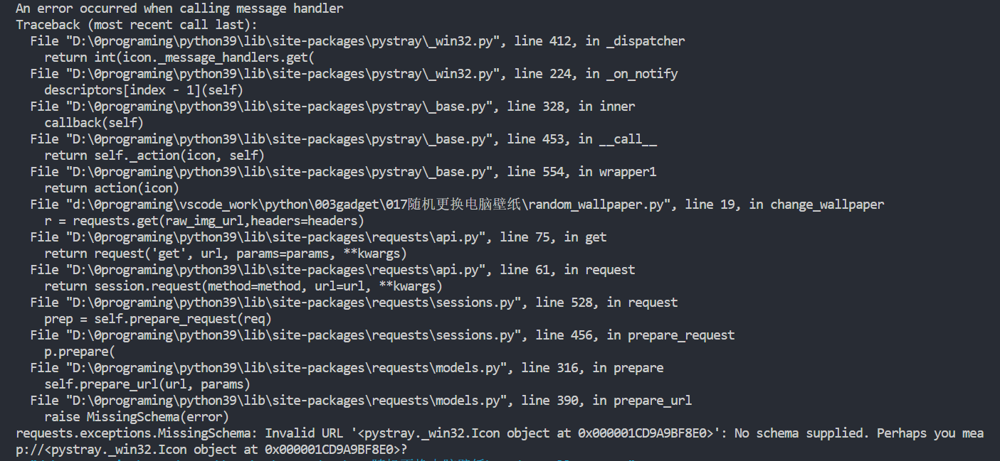

# 问题发现

报错如下图：



```python
def change_wallpaper(raw_img_url = "https://www.loliapi.com/acg/pc/?tpye=img"):
    headers = {
        'User-Agent': 'Mozilla/5.0 (Windows NT 6.1; WOW64) AppleWebKit/537.36 (KHTML, like Gecko) Chrome/67.0.3396.87 Safari/537.36',
    }
    r = requests.get(raw_img_url,headers=headers)
```

# 问题解决

如果change_wallpaper直接上来就是request请求则会报错，把函数改为如下则可以：

```python
def change_wallpaper():
    filepath = get_and_save_img()
    set_wallpaper(filepath)
```

在get_and_save_img()中再进行request请求。

原理尚不清楚，从表现来讲就是，不能在action函数这里直接使用request请求，在这个action函数调用别的函数，再进行request请求就可以啦。
