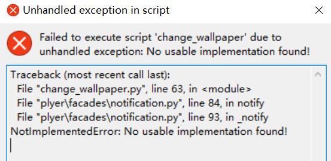

[python - Plyer &#34;NotImplementedError: No usable implementation found!&#34; while sending notifications in a .exe - Stack Overflow](https://stackoverflow.com/questions/68614527/plyer-notimplementederror-no-usable-implementation-found-while-sending-notif)

在打包命令末尾加上

```
--hidden-import plyer.platforms.win.notification
```
